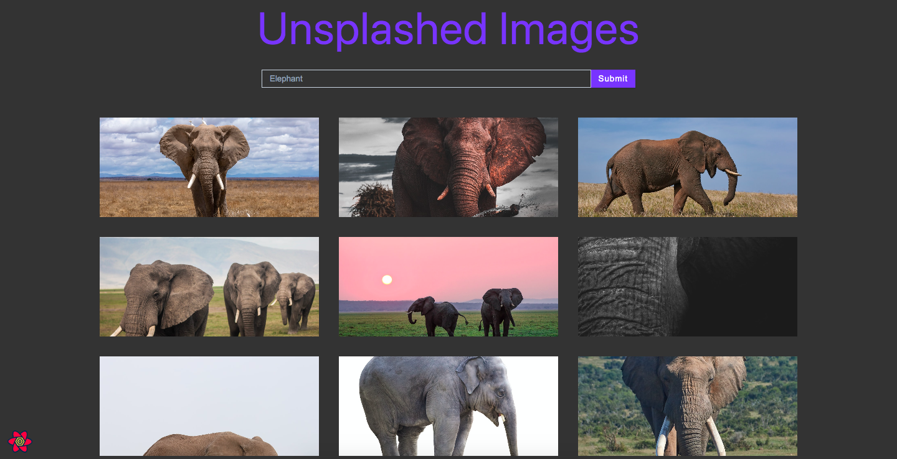

# Unsplashed Images



## Project Description

**Unsplashed Images** is an engaging `React.js` project that harnesses the power of the `Unsplash API` to deliver an immersive photo discovery experience. This innovative web application enables users to effortlessly explore a vast array of captivating photos by performing custom searches. With a seamless integration of technologies, including `Vite`, `JavaScript`, and `React.js`, **Unsplashed Images** delivers exceptional performance and user satisfaction.

*Key Features*:

- *Dynamic Photo Search*: **Unsplashed Images** empowers users to discover a multitude of photos catering to their preferences. By leveraging the `Unsplash API`, users can seamlessly search for and find images relevant to their interests.

- *Interactive Dark Mode*: Enhancing user comfort and visual aesthetics, the project features a sleek dark mode toggle. Users can effortlessly switch between light and dark modes, ensuring an enjoyable browsing experience day or night.

- *Efficient State Management*: With the integration of `React Query` and `Axios`, the application delivers optimized state management, empowering the application with efficient data fetching and caching, enhancing performance and user experience resulting in smoother interactions and faster load times.

- *Responsive Design*: The project embraces responsive design principles, adapting seamlessly to various screen sizes and devices, ensuring a consistent and delightful user experience across platforms.

**Unsplashed Images** represents an exceptional fusion of cutting-edge technologies and user-centric design. It serves as a testament to the capabilities of modern web development, delivering a feature-rich, visually immersive, and highly responsive platform for photo exploration. Whether users are seeking inspiration or simply enjoying the beauty of photography, **Unsplashed Images** offers an intuitive and engaging way to experience the world of images.

## Important Links

- https://unsplashed-images.netlify.app/

### Setup Steps

1. [Fork and Clone](https://github.com/iamatos3/unsplashed-images) this repository.
2. ```npm install```
3. ```npm run dev```

### Technologies Used

- Vite
- JavaScript
- React.js
- React Icons
- React Query
- Axios
- Unsplash API
- HTML
- CSS